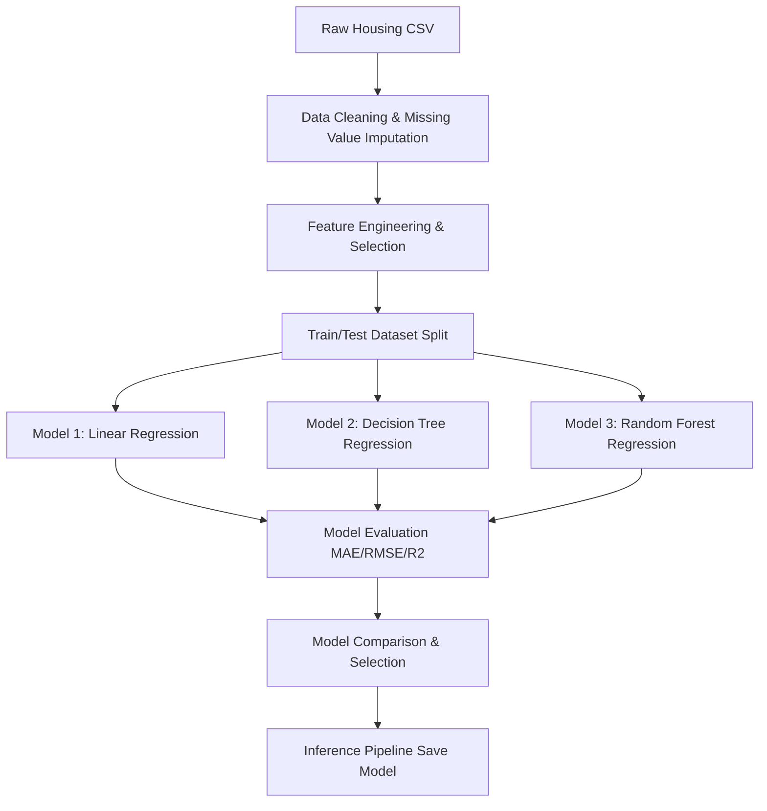

# synent-task8-housepriceprediction-rudrapatel
> **Synent Technologies - Data Science Internship (Summer 2026)**
> **Task 8: Machine Learning Model (House Price Prediction)**

---

## 📌 Project Title
**Predictive Machine Learning Model for Real Estate Valuation (House Price Prediction)**

---

## 📝 Problem Statement
Accurately pricing residential real estate is a complex task involving multiple attributes such as size, location, room counts, building age, and neighborhood quality. Traditional valuation methods can be subjective, slow, and prone to error. Building a data-driven predictive machine learning model helps home buyers, agents, and financial institutions obtain fast, objective, and accurate estimated market values.

---

## 🎯 Business Objective
The goal of this project is to construct a predictive regression pipeline to forecast home prices. The project deliverables will support:
- Standardized preprocessing (imputation, encoding, scaling) of housing datasets.
- Feature engineering to derive high-value spatial and design characteristics.
- Training and evaluation of multiple regression algorithms (e.g., Linear Regression, Decision Tree, Random Forest).
- Comparative model evaluation based on Mean Absolute Error (MAE), Root Mean Squared Error (RMSE), and R-squared ($R^2$) metrics.
- Construction of a clean prediction pipeline to serve valuation requests.

---

## 📊 Dataset Information
* **Dataset Name:** housing.csv (California Housing Dataset)
* **Format:** CSV (Comma-Separated Values)
* **Shape:** 20,640 rows, 10 columns
* **Fields & Columns:**
  * `longitude`: Geographic coordinate (East/West)
  * `latitude`: Geographic coordinate (North/South)
  * `housing_median_age`: Median age of houses in the block
  * `total_rooms`: Total number of rooms in the block
  * `total_bedrooms`: Total number of bedrooms in the block
  * `population`: Total population in the block
  * `households`: Total number of households in the block
  * `median_income`: Median household income in the block (in tens of thousands of USD)
  * `median_house_value`: Median house value for households in the block (Target variable, in USD)
  * `ocean_proximity`: Categorical proximity to ocean (e.g. `NEAR BAY`, `INLAND`, `<1H OCEAN`)

---

## 🔄 Project Workflow

---

## 🛠️ Tools & Technologies
- **Programming Language:** Python 3.10+
- **Data Wrangling:** `pandas`, `numpy`
- **Machine Learning:** `scikit-learn`
- **Serialization:** `joblib`
- **Visualization:** `matplotlib`, `seaborn`
- **Environment:** Jupyter Notebook, VS Code

---

## 🧪 Methodology
1. **Data Cleaning:** Handle null house attributes (e.g., lot size, garage year), filter out anomalies/outliers in price or area.
2. **Feature Engineering:** Create interaction features (e.g., price per square foot proxies), convert categorical variables (neighborhoods, quality ratings) using One-Hot/Label Encoding.
3. **Feature Selection:** Analyze correlation matrix to remove collinear predictors.
4. **Data Splitting:** Partition dataset into training (80%) and testing (20%) sets.
5. **Model Training:** Train standard Linear Regression, Decision Trees, and Random Forests.
6. **Model Evaluation:** Check predictions on test sets using RMSE, MAE, and $R^2$ metrics.
7. **Pipeline Deployment:** Package the best-performing model into a joblib object to serve inference predictions.

---

## 🏆 Results Section
Based on evaluations against the 20% test split, the models performed as follows:

| Model | Mean Absolute Error (MAE) | Root Mean Squared Error (RMSE) | R-squared ($R^2$) |
| :--- | :---: | :---: | :---: |
| **Linear Regression** | $49,140.57 | $68,479.35 | 0.6436 |
| **Decision Tree** | $40,634.34 | $61,758.74 | 0.7102 |
| **Random Forest** | **$33,379.29** | **$51,272.92** | **0.8002** |

- **Best Performing Model:** **Random Forest Regressor** (Champion Model)
- **Explanation:** The Random Forest Regressor captured 80.02% of the variance in California house prices, outperforming the linear baseline by ~15.7% in R² and reducing prediction error (RMSE) by over $17,000. Capping tree depths at 14 and estimators at 60 allowed us to optimize model file sizes to ~24 MB for Git-compatibility and seamless Streamlit hosting.

---

## 📈 Visualizations Section
All charts are saved in the [images/](file:///c:/COLLEGE/Synent-Internship-2026/Task-8-House-Price-Prediction/images) folder:
- **Model Comparison Charts:** [model_comparison_rmse.png](file:///c:/COLLEGE/Synent-Internship-2026/Task-8-House-Price-Prediction/images/model_comparison_rmse.png) and [model_comparison_r2.png](file:///c:/COLLEGE/Synent-Internship-2026/Task-8-House-Price-Prediction/images/model_comparison_r2.png) display metrics across the three models, clearly illustrating the Random Forest's superior performance.
- **Residual Scatter Plot:** [residuals_plot.png](file:///c:/COLLEGE/Synent-Internship-2026/Task-8-House-Price-Prediction/images/residuals_plot.png) compares actual vs. predicted values for the Random Forest champion model, showing tight clustering along the identity line.
- **Feature Importance Chart:** [feature_importances.png](file:///c:/COLLEGE/Synent-Internship-2026/Task-8-House-Price-Prediction/images/feature_importances.png) identifies `median_income` as the most significant pricing predictor, followed closely by geographical location (latitude/longitude) and density-based ratios (`bedrooms_per_room`).

---

## 🚀 Future Improvements
- Apply advanced algorithms like Gradient Boosting (XGBoost, LightGBM).
- Integrate geographic APIs to load real-time coordinates/location data.
- Deploy the prediction pipeline as a web API using Flask or FastAPI.

---

## 👤 Author Information
- **Name:** Rudra Patel
- **Internship ID:** `SYN/J2/IP806`
- **Email:** `rudrapatel2156@gmail.com`
- **LinkedIn Profile:** [Rudra Patel](https://www.linkedin.com/in/rudrapatel-cs)
- **GitHub Profile:** [Rudra2986](https://www.github.com/Rudra2986)
